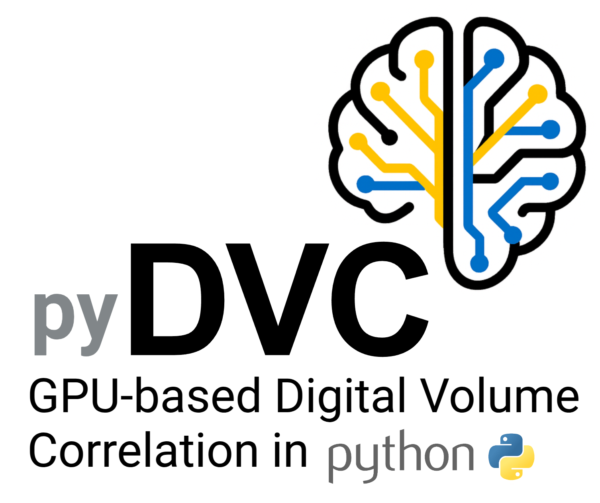

<p align="center">
  
</p>

# pyDVC

**GPU-based Digital Volume Correlation (DVC) for very large tomography datasets.**

pyDVC is a feasibility project. It asks whether the local, subvolume-based DVC
method behind [iDVC](https://github.com/TomographicImaging/iDVC) can be rebuilt
as a batched GPU pipeline that runs on multi-GPU nodes (target: 8× H100),
reading images from sharded OME-Zarr and storing search points and results in
the [zarr-vectors](https://github.com/AllenInstitute/zarr-vectors-py/tree/gpu-backend)
format through its GPU backend.

> [!NOTE]
> **Status: M0–M4 software done; no GPU measurement yet.** The whole
> pipeline works on one node: phantoms, the CCPi baseline, the numpy
> reference, the fused CUDA kernels, the numba CPU engine, zarr-vectors
> stores, OME-Zarr bricks, and one process per GPU with resume. The CUDA
> kernels were developed without a GPU. They are checked by compiling every
> specialisation with NVRTC and by running the `.cu` source in a host emulator
> against the numpy reference, but have not yet run on a GPU.
> **First measured comparison:** on a synthetic twin of the iDVC example
> (same geometry, points and settings), pyDVC's *CPU* engine on 4 cores is
> 22–37× faster than CCPi as iDVC runs it
> ([benchmarks](docs/benchmarks/2026-09-25-M4-case-A-twin.md)).
> [docs/MVP_PLAN.md](docs/MVP_PLAN.md) lists what the 8×H100 session must
> still measure.

---

## Why

iDVC is a GUI. The correlation itself runs in the CCPi DVC engine
([TomographicImaging/DigitalVolumeCorrelation](https://github.com/TomographicImaging/DigitalVolumeCorrelation),
Bay et al. 1999), a C++/OpenMP executable. That engine is accurate and well
established, but its structure limits it to modest point clouds:

| CCPi DVC today | Consequence at scale |
|---|---|
| Points are solved **one at a time**, in order of distance from a start point. Each is seeded from the average of already-solved neighbours. | OpenMP parallelism exists only *inside* a point (≈8 000 samples), so cores sit idle and GPUs cannot be used. |
| For **every point**, it re-reads a `(S + 2·disp_max + 4)³` box from **both** raw volumes row by row. Then it builds 8-term float64 derivative kernels over the whole box. | Most of each point's time is fixed overhead rather than correlation. The same voxels are read and processed hundreds of times. |
| The Jacobian comes from forward differences: `ndof + 1` objective evaluations per Gauss–Newton step. | ~2.5–4× more interpolation work than one analytic value+gradient pass. |
| Neighbour search is an O(N²) sort across the whole cloud. | Clouds of millions of points are impractical in a single run. |
| Inputs are flat raw/npy files and outputs are `.disp`/`.stat` text files. | Hard to use with 100 GB+ volumes, object stores or cluster file systems. |

pyDVC keeps the method (subvolume templates, 3/6/12-DOF shape functions,
SAD/SSD/ZSSD/NSSD/ZNSSD objectives, trilinear/tricubic interpolation, the same
status codes and output fields). It changes how the work is organised.

## How it works

```
  OME-Zarr (ref, def)            zarr-vectors point cloud            zarr-vectors results
  sharded dense volumes          spatially chunked search points     same chunk grid
          │                                   │                               ▲
          │ read brick (tile + halo)          │ read_cells(device="cuda")     │ write_chunk_* (disjoint cells)
          ▼                                   ▼                               │
 ┌───────────────────────── one process per GPU ─────────────────────────────┴─┐
 │  tile queue ─► prefetch bricks (side stream) ─► batches of B points          │
 │                                                  │                           │
 │   seed (coarse field / wavefront) ─► coarse grid search ─► batched GN solve  │
 │   (fused kernel: warp → tricubic value+∇ → residual → JᵀJ, Jᵀr per point)    │
 └──────────────────────────────────────────────────────────────────────────────┘
```

* **Tiles.** Groups of zarr-vectors point-cloud chunks, and the unit of work
  handed to a GPU. The chunk grid serves as the work partition: a tile owns
  its cells outright, so workers never write the same cell and need no locks.
  This follows zarr-vectors' three-phase HPC write pattern: allocate, write
  disjoint cells, rebuild presence.
* **Bricks.** For each tile, one read of the reference and deformed volumes
  covering the tile plus a halo of `radius + disp_max + stencil`. Every point
  in the tile correlates against the bricks already in GPU memory, so
  per-point I/O and preprocessing disappear.
* **Batches.** Thousands of points solved at once. All points share one sample
  template, so a batch is essentially an array of centres, seeds and
  parameters. A fused kernel does the warp, interpolation, residual and
  normal-equation accumulation in one pass, and the small `ndof × ndof`
  systems are solved in batch.
* **Seeding without serial order.** CCPi's neighbour-average seeding is
  inherently sequential. pyDVC offers:
  * `wavefront`: CCPi-parity mode. Points are bucketed into distance shells
    from the start point, and each shell is batched and seeded from earlier
    shells.
  * `coarse`: production mode. A sparse sub-grid is solved first and its field
    is interpolated to seed every point, which makes tiles independent.
  * FFT cross-correlation seeding is planned later.

  A repair pass re-seeds failed points from good neighbours and solves them again.

More detail: [docs/ARCHITECTURE.md](docs/ARCHITECTURE.md).

## Expected improvement (modelled, not measured)

| Scenario | CCPi DVC as shipped | pyDVC | Modelled speed-up |
|---|---|---|---|
| **A**: iDVC example (1520×1257×1260 u8, 4 680 pts, S=80 sphere, 8 000 samples, 6-DOF, tricubic, ZNSSD) | ~4–11 min on one workstation | ~2–6 s on **1** H100 (bound by I/O) | **~40–300×** end-to-end |
| **B**: 4096³ u16 pair (275 GB), ~8.4 M pts, S=48 sphere, 4 096 samples, 6-DOF | ~1.5–5 days per process; the point cloud must be split into ~10³ runs | ~1–3 min on **8×H100** | **~700–7 000×** end-to-end |

Most of that gain comes from **restructuring** (bricks, analytic Jacobians,
batching), not from the GPU itself. Compared with an equally restructured
multi-core CPU backend, the 8×H100 node's modelled advantage depends on the
workload:

* **~1.5–12×** for scenario B, where the GPUs finish in seconds and wait on storage;
* **~30–300×** when compute dominates: 12-DOF, full-voxel subvolumes, grid
  searches, bulk parameter sweeps, time series.

The MVP therefore benchmarks three backends (CCPi, restructured CPU and GPU)
so the gains can be attributed correctly. The derivation and assumptions are
in [docs/PERFORMANCE.md](docs/PERFORMANCE.md).

## Repository layout

```
pyDVC/
├── README.md
├── pyproject.toml
├── configs/                      example run configurations (YAML)
│   ├── synthetic_small.yaml      256³ synthetic case, dev GPU
│   ├── ccpi_central_grid.yaml    parity case: iDVC example dataset + CCPi test settings
│   └── large_8xh100.yaml         4096³ production-style run
├── docs/
│   ├── ARCHITECTURE.md           decomposition, data formats, memory budget, divergences from CCPi
│   ├── MVP_PLAN.md               milestones M0–M5, acceptance criteria, risks
│   └── PERFORMANCE.md            cost model and speed-up estimate
├── scripts/slurm/
│   ├── pydvc_8xh100.sbatch       plan → seed → run → finalize on a GPU node
│   ├── case_L.sbatch             synthesise case L, then Q2 / Q3 / end to end
│   └── storage_baseline.sh       fio + pyDVC read-path bandwidth
├── src/pydvc/
│   ├── config.py                 RunConfig (YAML / CCPi dvc_in import)
│   ├── status.py                 PointStatus (CCPi-compatible codes)
│   ├── cli.py                    `pydvc synth|convert|plan|seed|run|repair|finalize|compare|ccpi`
│   ├── io/
│   │   ├── volume.py             VolumeSource: OME-Zarr / raw / npy bricks → device
│   │   ├── pointcloud.py         .roi/.txt import, zarr-vectors point-cloud store, tile reads
│   │   ├── results.py            zarr-vectors results store (allocate / write tile / finalize)
│   │   └── ccpi.py               dvc_in parser, .disp/.stat writers (iDVC compatibility)
│   ├── geometry/
│   │   ├── box.py                integer voxel boxes (tiles, bricks, halos)
│   │   ├── templates.py          cube / sphere subvolume sample templates
│   │   ├── warp.py               3/6/12-DOF shape functions and their Jacobians
│   │   └── pointgrid.py          iDVC-style point-cloud generation inside a mask
│   ├── kernels/                  array-namespace (numpy | cupy) numerics
│   │   ├── xp.py                 device dispatch
│   │   ├── interpolate.py        batched nearest / trilinear / tricubic (+ gradient)
│   │   ├── objective.py          batched SAD / SSD / ZSSD / NSSD / ZNSSD, one-pass normal-equation sums
│   │   ├── fused.py              fused CUDA Gauss–Newton step (cupy.RawModule)
│   │   ├── cuda/                 fused_gn.cu, and a host emulator that runs it without a GPU (tests)
│   │   └── cpu_fused.py          same step on CPU cores (numba), for the restructured-CPU baseline
│   ├── solver/
│   │   ├── gauss_newton.py       batched FA-GN (CCPi parity) and IC-GN
│   │   ├── engines.py            numpy / cupy / fused / cpu engines behind one GN loop
│   │   ├── coarse.py             batched translation grid search; FFT-CC seeding
│   │   └── seeding.py            kNN graph, wavefront shells, coarse-field seeds, repair
│   ├── pipeline/
│   │   ├── tiling.py             tiles, brick boxes, memory estimates, LPT assignment
│   │   ├── batching.py           batch sizing and spatially coherent ordering
│   │   ├── worker.py             per-GPU tile loop with prefetch double-buffering
│   │   ├── launch.py             process-per-GPU launcher, SLURM / torchrun / MPI rank discovery
│   │   ├── coordinator.py        prepare / seed / run / repair / finalize
│   │   └── inmemory.py           whole-volume single-process solve (reference, parity)
│   ├── synth/phantoms.py         speckle volumes + known displacement fields
│   ├── post/strain.py            strain from displacement (kNN least squares)
│   └── bench/                    CCPi baseline + head-to-head (case A), accuracy, throughput, scaling
└── tests/                        acceptance tests per milestone (unimplemented → skipped)
```

## Planned usage

The CLI surface is fixed now so the milestones build toward it. Working today
(M0–M4) on one node, with one process per GPU (`--backend fused|cupy|cpu|numpy`,
default: `fused` with a GPU, else `cpu` with numba):

```bash
pydvc synth --shape 256 256 256 --field affine --spacing 16 --out data/synth256   # case S
pydvc plan     data/synth256/config.yaml        # points store, tiles, bricks, memory check, results store
pydvc seed     data/synth256/config.yaml        # wavefront / coarse / rigid
pydvc run      data/synth256/config.yaml        # tile loop; skips tiles already written (resume)
pydvc finalize data/synth256/config.yaml --disp
pydvc compare  data/synth256/results.zarrvectors data/synth256/truth.npz
pydvc solve    data/synth256/config.yaml        # whole-volume in-memory solve (reference / parity)
python -m pydvc.bench.ccpi_baseline data/synth256/config.yaml --workdir runs/ccpi_S
python -m pydvc.bench.throughput --backend fused cpu --samples 2000 --dof 6 12

# the iDVC example dataset (Zenodo 7363345): CCPi as iDVC runs it vs pyDVC, speed and agreement
python -m pydvc.bench.case_a fetch --data data/magma
python -m pydvc.bench.case_a run --data data/magma --out runs/case_A --ccpi-exe /path/to/ccpi-dvc-22.0.0/bin/dvc

# one 8x H100 node: case L, storage baseline, Q2/Q3, end to end
sbatch scripts/slurm/case_L.sbatch 2048 /scratch/pydvc/caseL2048
```

Repair, the CCPi drop-in and tested multi-node runs arrive with M5:

```bash
# 1. make a synthetic case with a known displacement field
pydvc synth --shape 256 256 256 --field affine --out data/synth256

# 2. convert CCPi/iDVC inputs (raw, mhd, npy, tiff) to sharded OME-Zarr once
pydvc convert dataset_0.npy data/ref.ome.zarr --chunk 128 --shard 1024

# 3. run on one node with all GPUs
pydvc plan    configs/large_8xh100.yaml     # tiles, bricks, memory check, result store allocation
pydvc seed    configs/large_8xh100.yaml     # coarse pass → seed field
pydvc run     configs/large_8xh100.yaml     # one process per GPU, dynamic tile queue
pydvc repair  configs/large_8xh100.yaml     # re-seed and re-solve failed points
pydvc finalize configs/large_8xh100.yaml    # presence, metadata, .disp/.stat export

# or submit the whole chain
sbatch scripts/slurm/pydvc_8xh100.sbatch configs/large_8xh100.yaml

# 4. drop-in replacement for the CCPi `dvc` executable (reads dvc_in, writes .disp/.stat)
pydvc ccpi dvc_config.txt
```

```python
from pydvc import RunConfig
from pydvc.pipeline import coordinator

cfg = RunConfig.from_yaml("configs/synthetic_small.yaml")
coordinator.prepare(cfg)
coordinator.seed(cfg)
coordinator.run(cfg)          # one process per visible GPU
coordinator.finalize(cfg, export_disp=True)
```

## Installation and testing

Python ≥ 3.11. **[docs/TESTING.md](docs/TESTING.md)** walks through
installation, the local self-test, the first GPU run, the iDVC example dataset
and the cluster runs. In short:

```bash
micromamba create -f envs/pydvc-cpu.yml && micromamba activate pydvc   # or envs/pydvc-gpu.yml (CUDA 12)
pip install -e ".[test,cpu-fast]"     # pyDVC + zarr + zarr-vectors (pinned gpu-backend commit) + numba
pytest -q && pydvc selftest           # ~5 min; PASS/FAIL per backend
eval "$(scripts/get_ccpi_dvc.sh)"     # optional: CCPi dvc 22.0.0 for the baselines
```

zarr-vectors is pinned to a commit on its `gpu-backend` branch, since that
branch is under active development. Optional extras: `[gpu]` (cupy, GPU
codecs), `[gpu-io]` (kvikio / GPUDirect Storage), `[mpi]`, `[tiff]`.

## Data conventions

* **Coordinates.** Point positions are `(x, y, z)` in voxel units, matching
  CCPi/iDVC `.roi` files. Voxel `i` sits at coordinate `i`. Volumes are indexed
  `[z, y, x]`.
* **Images.** OME-Zarr v3 with sharding (for example 128³ chunks in 1024³
  shards aligned to the tile size). The native dtype (u8/u16/f32) stays on
  device and is converted in registers.
* **Search points and results.** zarr-vectors point-cloud stores on the same
  chunk grid. Results are vertex attributes: `point_id`, `status`, `objmin`,
  `displacement[3]`, `params[ndof]`, `n_iter`, `seed[3]`, and later
  `strain[6]`. They can be exported to CCPi `.disp`/`.stat` for iDVC's
  results viewer, and read by any zarr-vectors / Neuroglancer tooling.

## Roadmap

| Milestone | Delivers |
|---|---|
| **M0** | Synthetic phantoms, CCPi baseline runner, measured CPU baselines |
| **M1** | numpy reference: templates, warps, interpolation, objectives, batched FA-GN |
| **M2** | Single-GPU CuPy + fused kernel, parity with M1 |
| **M3** | OME-Zarr bricks, zarr-vectors stores, tiling, single-GPU end-to-end |
| **M4** | 8-GPU launcher, dynamic tile queue, resume, finalize: **the MVP** |
| M5 | IC-GN, coarse/FFT seeding, repair, strain, iDVC drop-in, multi-node |

Details, acceptance criteria and risks: [docs/MVP_PLAN.md](docs/MVP_PLAN.md).

## Acknowledgements and citation

pyDVC reimplements the method of the CCPi DVC code by Prof. Brian K. Bay and
collaborators (UKRI-STFC, Oregon State University), which iDVC drives. If you
use pyDVC, please cite:

1. B. K. Bay, T. S. Smith, D. P. Fyhrie, M. Saad, "Digital volume correlation:
   Three-dimensional strain mapping using x-ray tomography", *Experimental
   Mechanics* 39, 217–226 (1999). doi:10.1007/BF02323555
2. B. K. Bay, "Methods and applications of digital volume correlation",
   *J. Strain Analysis* 43, 745–760 (2008). doi:10.1243/03093247JSA436
3. zarr-vectors-py and the Zarr Vectors specification (F. Collman, Allen Institute).

Example data: P. Lee, Y. Lavallée, B. Bay, "Dynamic X-ray CT of Synthetic
magma for Digital Volume Correlation analysis" (2022), Zenodo,
doi:10.5281/zenodo.7363345.

## License

**To be decided before any code is ported.** The CCPi DVC engine is GPL-3.0
and iDVC is Apache-2.0. zarr-vectors-py is BSD-style. If CCPi source is
translated line by line, pyDVC must be GPL-3.0. A clean-room implementation
from the published method (the current intent) leaves the choice open.
