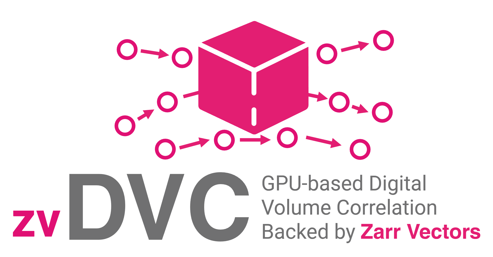

<p align="center">
  
</p>

# zvDVC

**GPU-based Digital Volume Correlation (DVC), backed by Zarr Vectors.**

zvDVC measures how a material deforms between two 3-D scans, for tomography
datasets too large for existing DVC tools. It reimplements the subvolume-based
method of [iDVC](https://github.com/TomographicImaging/iDVC) and the CCPi DVC
engine that iDVC runs (Bay et al., 1999) as a batched GPU pipeline for
multi-GPU nodes. The method, status codes and file formats follow iDVC and
CCPi, and `zvdvc-dvc` can stand in for CCPi's `dvc` inside iDVC.

It is also a use case for
[Zarr Vectors](https://github.com/AllenInstitute/zarr-vectors-py). Search
points and results live in zarr-vectors stores, whose chunk grid is zvDVC's
unit of work. The aim is to show what zarr-vectors' GPU backend, including
GPUDirect Storage, gains a real HPC workload.

zvDVC was previously called pyDVC.

📖 **Documentation: [zvdvc.readthedocs.io](https://zvdvc.readthedocs.io)**

> [!NOTE]
> **Status.** On iDVC's example dataset (4 680 points), zvDVC takes 1.6 s on
> an RTX A2000; CCPi DVC, as iDVC runs it, takes 37 min. Interior points agree
> with CCPi in status on 100 % of points, with no systematic displacement
> difference ([report](docs/benchmarks/2026-09-26-case-A-real.md)). Multi-GPU
> runs on 8× H100 are implemented but not yet measured. **GPUDirect Storage is
> not wired in or measured yet**: every number so far uses host reads.

## Install

Python ≥ 3.11.

```bash
micromamba create -f envs/zvdvc-gpu.yml && micromamba activate zvdvc-gpu   # or envs/zvdvc-cpu.yml
pip install -e ".[test,cpu-fast]"
zvdvc selftest                       # PASS/FAIL per backend
```

Extras: `[gpu]`, `[gpu-io]` (kvikio / GPUDirect Storage), `[mpi]`, `[tiff]`.
See [Installation](https://zvdvc.readthedocs.io/en/latest/getting_started/installation.html).

## Quick start

```bash
zvdvc synth --shape 128 128 128 --field affine --out data/synth128   # volumes with a known deformation
zvdvc plan     data/synth128/config.yaml
zvdvc seed     data/synth128/config.yaml
zvdvc run      data/synth128/config.yaml
zvdvc finalize data/synth128/config.yaml --disp
zvdvc compare  data/synth128/results.zarrvectors data/synth128/truth.npz
```

Next: the [tutorials](https://zvdvc.readthedocs.io/en/latest/tutorials/synthetic_first_run.html),
including [iDVC's example dataset](https://zvdvc.readthedocs.io/en/latest/tutorials/idvc_example.html)
and [using zvDVC from iDVC](docs/IDVC.md).

## Citing

If you use zvDVC, please cite iDVC and the CCPi DVC method it implements, as
well as zvDVC and Zarr Vectors:

1. iDVC, Tomographic Imaging / CCPi, UKRI-STFC.
   <https://github.com/TomographicImaging/iDVC>
2. B. K. Bay, T. S. Smith, D. P. Fyhrie, M. Saad, "Digital volume correlation:
   Three-dimensional strain mapping using x-ray tomography", *Experimental
   Mechanics* 39, 217–226 (1999). doi:10.1007/BF02323555
3. B. K. Bay, "Methods and applications of digital volume correlation",
   *J. Strain Analysis* 43, 745–760 (2008). doi:10.1243/03093247JSA436
4. zarr-vectors-py (BRIDGE Neuroscience) and the Zarr Vectors specification
   (F. Collman, Allen Institute).

BibTeX and an acknowledgement sentence:
[How to cite](https://zvdvc.readthedocs.io/en/latest/how_to/cite.html).

## License

GPL-3.0-or-later; see [LICENSE](LICENSE). The CCPi DVC engine is GPL-3.0,
iDVC is Apache-2.0 and zarr-vectors-py is BSD-style.
